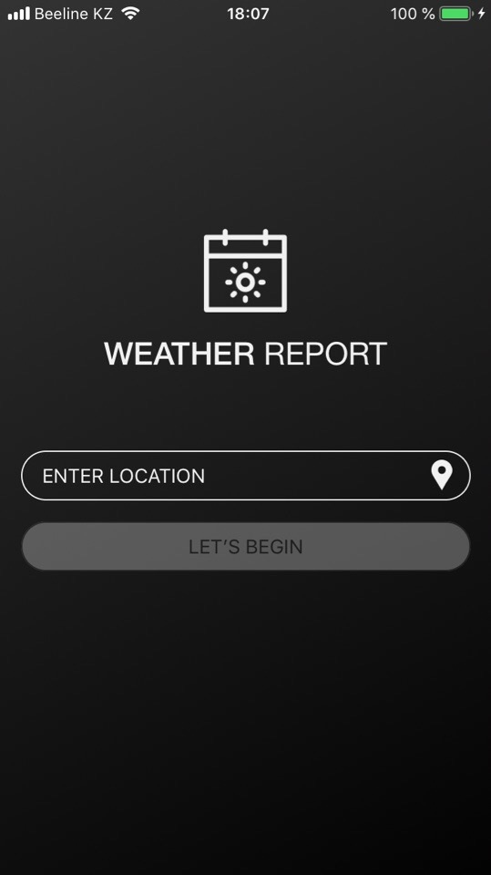
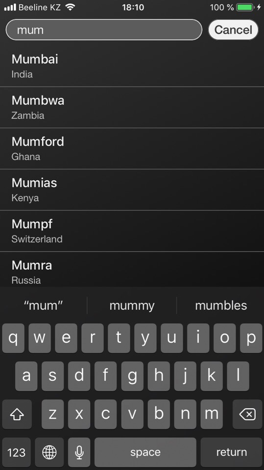
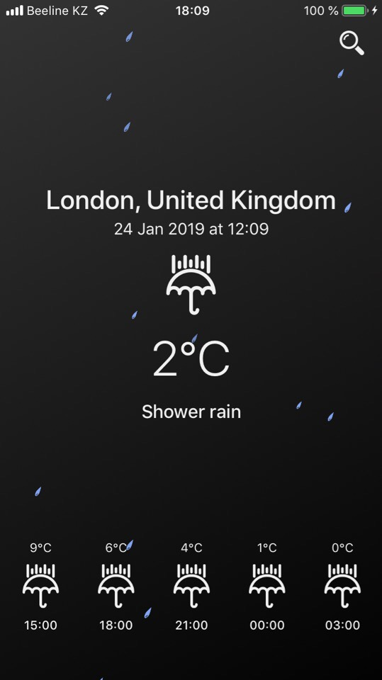
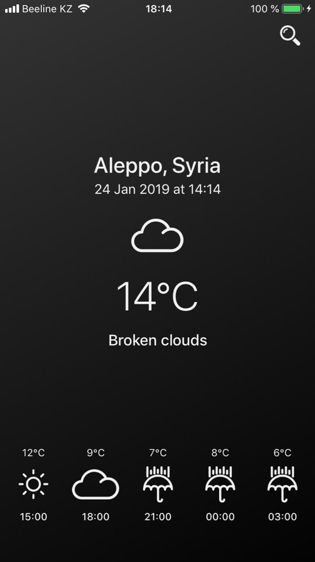

# WeatherSwift
Weather app developed on Swift 4.2 using MVVM + Router architecture

## Used in project:
- RxSwift used for binding
- Database of cities is stored in RealmSwift
- OpenWeatherMap service to get weather data
- TimeZoneDb to get local time zone

## TODO:
- Add activity indicator
- Moon icon instead sun at night time
- Show correct time in the forecast list

## Screenshots:

   
