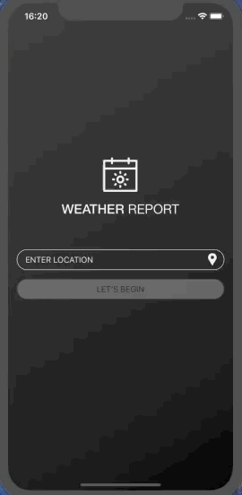

# WeatherSwift
Weather app developed on Swift 4.2 using MVVM + Router architecture

## Used in project:
- RxSwift for bindings
- Database of cities is stored in RealmSwift
- OpenWeatherMap service to get weather data
- TimeZoneDb to get local time zone

## TODO:
- Moon icon instead sun at night time
- Implement saving a list of recently selected cities
- Implement show the last selected city at startup

## Screenshots:

   
